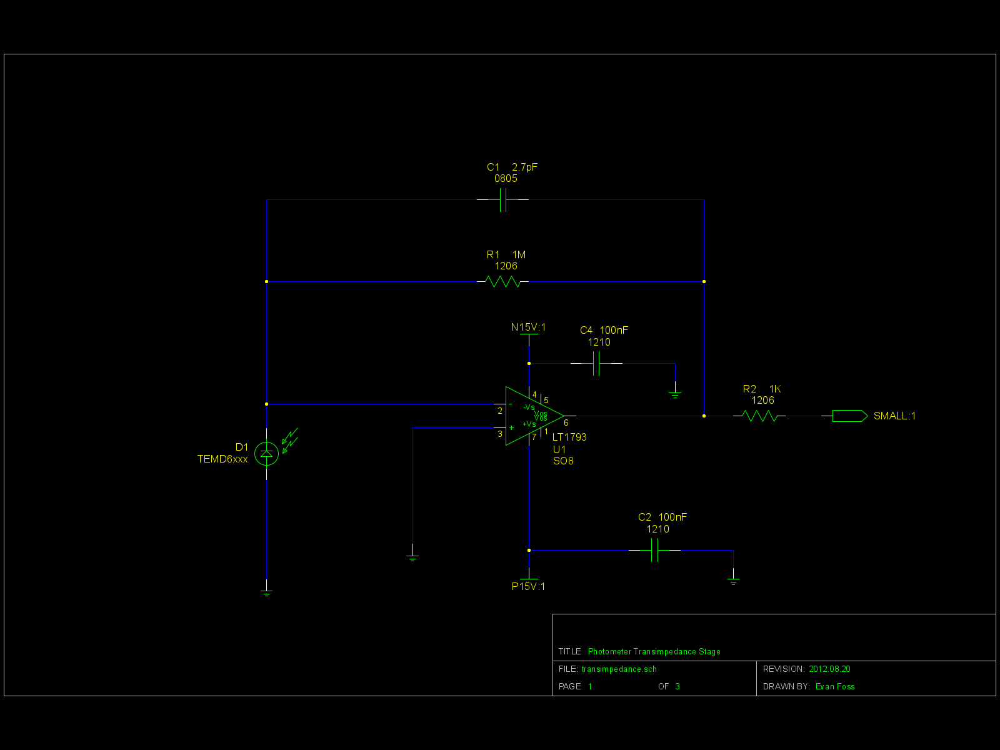

# EPL Photometer

By Evan Foss
Date 2011.10.05 (YYYY.MM.DD)
Documentation reuploaded 2025.03.12 by EEF

## Project Description
This project is a photometer, unlike a conventional light meter it is designed to take readings of a stroboscopic light source. It is compact and shielded enough to put in a chamber and operate continuously. It is not meant for perfect for any application because of the limitations in it's response to specific wavelengths and in calibration. It is made with the best matched photodiodes available in our price range. It is also limited in that do to our inability to develop a good reference for single wavelength calibration the device is only good for qualitative (relative) measurements not quantitative measurements. We are working to rectify this last limitation but there is no telling how long it will take to find an adequate calibration method.

# Development

## Toolchain

The development toolchain was as follows:

|Tool Name             | License        | Function
|:---------------      | :------------- | :-----------------
|<a href="https://www.sagemath.org/">SageMath</a>                                            | Open Source       | Scientific Programming Language used for calculations
|<a href="https://github.com/lepton-eda/lepton-eda">lepton-eda</a>                           | Open Source       | EDA (Electronic Design Automation) suite lepton-eda a fork of gEDA
|<a href="http://repo.hu/projects/pcb-rnd/">pcb-rnd</a>                                      | Open Source       | CAD (Computer Aided Design) tool for PCB (Printed Circuit Board) layout gEDA/PCB
|<a href="https://gerbv.github.io/">gerbv</a>                                                | Open Source       | Gerber viewer
|<a href="https://www.gnu.org/software/make/">GNU/Make</a>                                   | Open Source       | Toolchain automation

The project was originally designed using gEDA but Lepton-EDA is backward compatible to it. Like wise the original PCB artwork was designed in gEDA/PCB which was also forked to create pcb-rnd which is also backward compatible.

For the math I was doing I suggest migrating off SageMath to <a href="https://octave.org/">Octave</a> as Sagemath maintence for work this simple is excessive.

## Organization
4alberta		The files for the LT1793-sheilded version of the board.
README.text		This file.
datasheets		The data sheets for the various parts used/(considered for use) in the project.
lt1793-sheilded		The 1st production version of the device using an LT1793 for the transimpedance amplifier and a shield using 0.1" spaced headers.
lt1793-unsheilded	The pre-production version of the device using an LT1793 for the transimpedance amplifier minus the shield.
ltc6240			The pre-production version of the device using an LTC6240 for the transimpedance amplifier for higher frequency responce. This design is incomplete.
math			The scripts and calculations used for the design of the device.

## Design

The photometer uses a photodiode to convert illumination into an electrical current. The current is amplified by a transimpedance stage converting it to a voltage. The voltage is then amplified by a second amplifier that is also capable of driving the capacitive load from the BNC cable. Ideally all the gain would take place in one stage but that is not possible because of real world limitations on the size of the feedback resistor, input capacitance, amplifier stability and etc. More on this will be explained later.

The input diode was selected because it had response in the relevant areas. Many diodes were considered but the TEMD6010FX1 was selected because it had some response in the shorter wavelengths and because it had relatively low capacitance. There were other diodes with more appropriate response but they were all unobtanium because of the minimum quantity required. To carry the project forward we have to assume some things about what the maximum and typical levels of illumination will be. With the amount of illumination the amount of current can be used to work out the required amount of gain for the rest of the device.

The feedback resistor on the transimpedance stage is not large enough on it's own so a second stage is required. The LT1793 was chosen for the transimpedance stage because it has reasonably low input current bias and input current offset which are better for obvious reasons. The LT1793 also has a low input capacitance which is important for stability and just to finish off it has a reasonable gain band width product. For higher bandwidths the LTC6240 was considered but do not need the bandwidth yet. While it is possible to make a larger resistance it would not work because the minor capacitance across the pads of the resistors footprint will be large enough to limit total feedback impedance as frequency increases. While some feedback capacitance is good for compensating the amplifier the effect would be excess role off.

The second stage is really just meant to pick up the slack from the transimpedance stage and driving the capacitive load of the output cable. It is the ability to drive a capacitive load that is why the LF356 was selected over any number of otherwise comparable amplifiers. The input resistance for the LF356 was selected because it was a reasonable margin from the output current of the LT1793. The math included in the project also checks if there should be a feedback capacitor on the second stage amplifier. It is highly unlikely to be needed.

This is just the shielding for the device. Transimpedance amplifiers are very noise sensitive.

# Construction

The construction of the photometer seems straight forward until you consider the troubles of making it compact with only 2 layers for cost reasons and only 1 layer used for the design because the bottom is going to be used as part of the shield. The whole design except for the connector and the shield is done in SMT. 

Doing the shield in SMT was considered but that would have meant using a sheet of brass or copper and soldering it directly to the back layer of the board. While this is possible it would make rework on the board difficult and it would put considerable thermal stress on the board. The pads such a shield would have needed would have been of considerable size and the heat used to solder them might have cause them to delaminate off the board substraight. The  photodiode needs to be exposed for the best results but it also must be on the board to reduce capacitance so there is a whole in the shield. It has been our experience that holes attract all manner of unwanted contaminants so the shield needs to be removable for cleaning. It adds a considerable mount of bulk but 0.100” headers are used to connect the shield to the board. The shield being a piece of perforated board with a ground plane on it soldered to the headers.

While the space between the transimpedance amplifier and the output stage amplifier is not that critical many other areas are very tightly controlled. The space between the photodiode and the trans-impedance amplifier should be as short as possible to reduce trace capacitance. The distance between the feedback resistors and their accompanying amplifiers also have to be kept short. The input resistor on the output amplifier is not very controlled and given the small size of the whole space the distance between the decoupling capacitors and everything else is also with in reason not critical. 

Making the connector in SMT was considered but having the connector pins go threw the board helps mechanically if the connector sees excess torc which can happen. The downside is of course that those points are exposed to the outside and could introduce noise but if this is a problem a small bit of adhesive backed copper foil can be put over the clip side of the connector or indeed the whole mating area.

To get from the connector on the photometer to the rest of the world there are two different methods. In a chamber the device uses a shielded cable carrying both the power and signal lines to an PCB with and edge card connector. The edge card supplies power from our standard EPL configuration of the EFP series vector subrack. The signal comes out of that same board via a right angle BNC connector. In the second configuration we use two shielded cables on going to a MiniHEX9 for power and the other to a BNC connector for the signal output. Because of the outside of the BNC cable being only at analog ground and not at shield potential this version is not suitable for use in a chamber.

# Future

We only have to needs from this device that are unfulfilled. First we would like to be able calibrate it to a source of a known wavelength and power. Second it would be nice if it could have a better response at smaller wavelengths. Sadly we do not have the resources at this point but that may change later.

